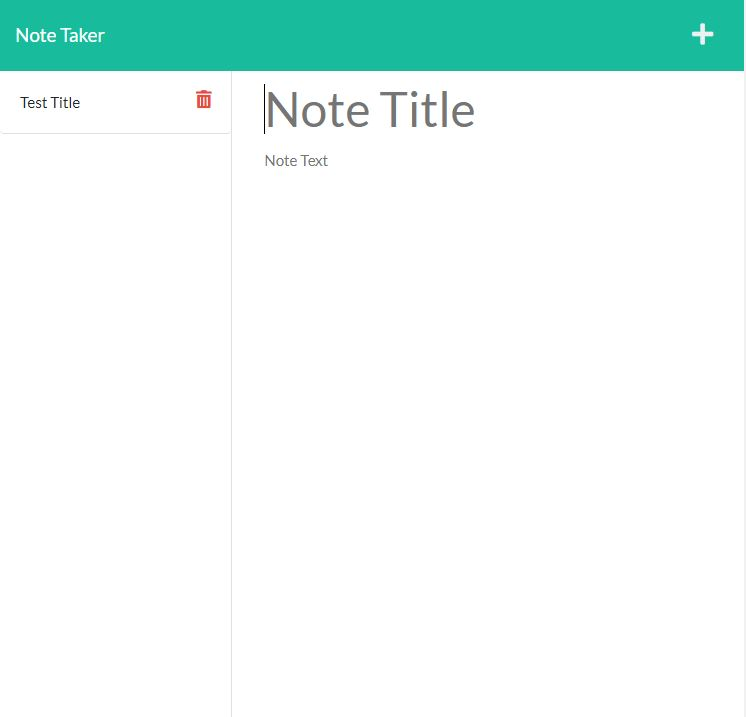
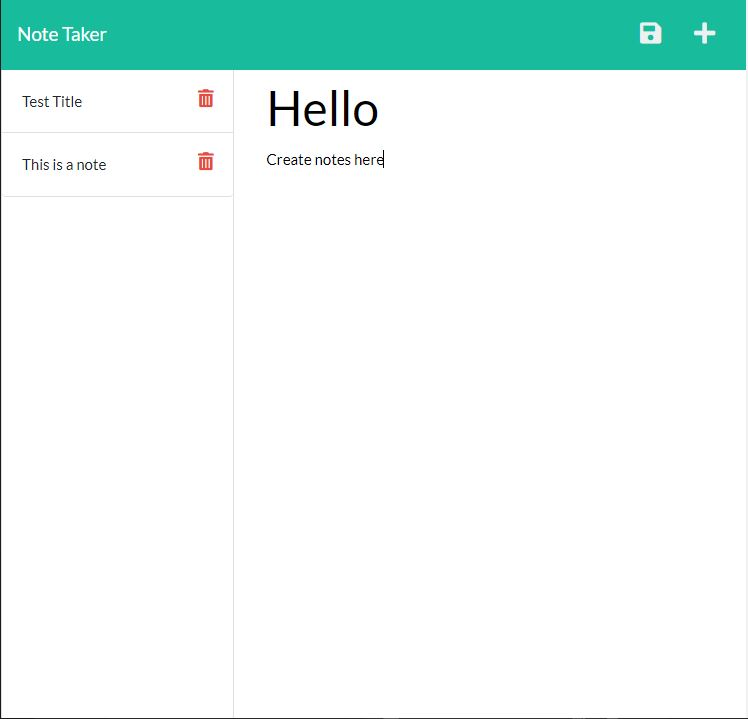

## Note Taker v1.0


## License description: (https://opensource.org/licenses/MIT)

## Description:
With this note taking application you can create new notes and save them to a live server! If you decide you no longer need a specific note you can delete them with the click of a button. The application can be run through node or is live @ https://note-taker-ct.herokuapp.com/.





## Table of Contents
* [Description](#description)
* [Installtion](#installation)
* [Usage Info](#usage)
* [Contributions](#contributing)
* [Testing](#tests)
* [Questions](#questions)


## Installation: 
If using node you can run npm i and then npm start. Follow link to view it!
```bash
npm i
```

```bash
npm start
```


## Usage: 
With those installed or viewing on the live heroku server you can now create and delete notes.


## Contributions: 
Contributing is open to anyone!


## Questions:
If you have any questions please contact me at chris.tierney3@gmail.com or https://github.com/christierney3